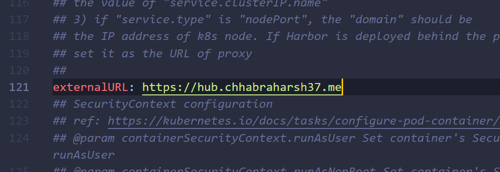
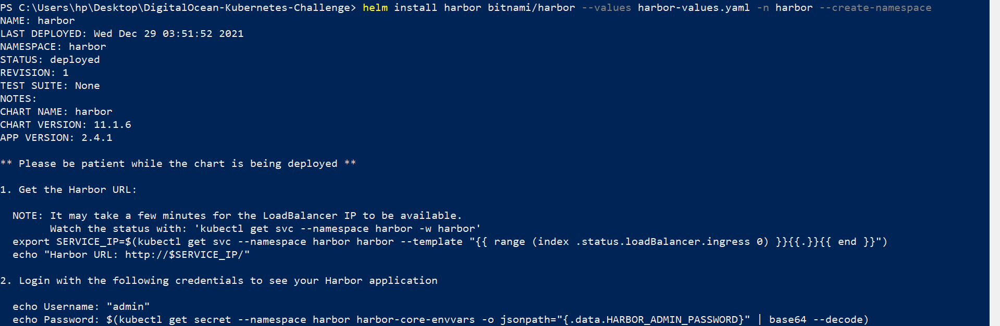

# DigitalOcean-Kubernetes-Challenge

Attempting Challenge: Deploy an internal container registry for DigitalOcean's Kubernetes program.<br>

## Installing Prerequisites 
We have to first install Chocolately to be able to install kubectl (Reference: https://chocolatey.org/install#individual):

    Set-ExecutionPolicy Bypass -Scope Process -Force; [System.Net.ServicePointManager]::SecurityProtocol = [System.Net.ServicePointManager]::SecurityProtocol -bor 3072; iex ((New-Object System.Net.WebClient).DownloadString('https://community.chocolatey.org/install.ps1'))

Now needed things to install, using Chocolately:

    choco install kubernetes-helm
    choco install kubernetes-cli
    kubectl version --client

## Steps

Step 1: We have to install `doctl` - DigitalOcean CLI tool (Reference: https://docs.digitalocean.com/reference/doctl/how-to/install)

Step: 2: Create a Kubernetes cluster
         (Either by using command line doctl or through DigitalOcean web platform)

```
doctl kubernetes cluster create do-k8s-challenge
```
>OUTPUT


It take few minutes in creating the cluster, after that we get this output.
After 5 to 10 minutes our cluster is created successfully and we get this output.


Through DigitalOcean web platform we can set Cluster settings according to us.


We can also download Config file.


Step 3: Harbor installation steps

Let's start the challenge. We are using Bitnami [helm chart](https://bitnami.com/stack/harbor/helm) to deploy Harbor

Add bitnami repo to Helm

```
helm repo add bitnami https://charts.bitnami.com/bitnami
```
> OUTPUT
```
PS C:\Users\hp\Desktop\DigitalOcean-Kubernetes-Challenge> helm repo add bitnami https://charts.bitnami.com/bitnami
"bitnami" has been added to your repositories
```
Before installing helm chart we need to edit the yaml file, so we have to create a yaml file first.
```
helm show values bitnami/harbor > harbor-values.yaml
```

open `harbor-values.yaml` in a editor

change the external URL value to `externalURL: https://hub.chhabraharsh37.me` 




set admin password `harborAdminPassword: "<YOUR PASSWORD>", we can set it as "Harbor123"`


and commonName `commonName: 'hub.chhabraharsh37.me'`


Install Harbor via helm
```
helm install harbor bitnami/harbor --values harbor-values.yaml -n harbor --create-namespace
```
>OUTPUT




Check pods status - (everything is running now)


Get External-IP of Harbor loadbalancer


we have to use the external IP to login to Harbor
- UserName: admin
- Password: <PASSWORD_entered_on_yaml>


Create a new project and make it public, so pulling image doesn't need authentication.


Now lets try to push a container(httpd) image to Harbor


first we need to tag our container, so we do this 

```
docker tag httpd:alpine hub.chhabraharsh37.me/k8s/https:latest
```
>OUTPUT
```
docker tag httpd:alpine hub.chhabraharsh37.me/k8s/https:latest
```


Login to `hub.chhabraharsh37.me` on Docker

*NOTE: if DNS is not resolved edit hosts file and add the IP of Harbor*

```
docker login hub.chhabraharsh37.me
```
>OUTPUT
```
PS C:\Users\hp\Desktop\DigitalOcean-Kubernetes-Challenge> docker login hub.chhabraharsh37.me
Username: admin
Password: 
Login Succeeded
```


Now we can push our image to our hub

```docker
docker push hub.chhabraharsh37.me/k8s/https
```
>OUTPUT (Successfully pushed)
```
PS C:\Users\hp\Desktop\DigitalOcean-Kubernetes-Challenge> docker push hub.chhabraharsh37.me/k8s/https
Using default tag: latest
The push refers to repository [hub.chhabraharsh37.me/k8s/https]
59bf1c3509f3: Pushed
085d9bf42ab2: Pushed
907dfa98a03e: Pushed
242407d61b32: Pushed
aa5e87b8047c: Pushed
f1ff32cc6322: Pushed
latest: digest: sha256:c7b8040505e2e63eafc82d37148b687ff488bf6d25fc24c8bf01d71f5b457531 size: 1572
```
Image available at Harbor 


Lets deploy this app using [httpd-deployment.yaml](httpd-deployment.yaml) file

```
kubectl apply -f httpd-deployemnt.yaml
```
>OUTPUT
```
PS C:\Users\hp\Desktop\DigitalOcean-Kubernetes-Challenge> kubectl apply -f httpd-deployment.yaml
service/httpd-service unchanged
deployment.apps/httpd-deployment created
PS C:\Users\hp\Desktop\DigitalOcean-Kubernetes-Challenge> kubectl get pod
NAME                                READY   STATUS    RESTARTS   AGE
httpd-deployment-6559f66ffd-4pqlm   1/1     Running   0          9m58s
```
In this project we created our Kubernetes internal container registry (Harbor) and pushed our local image to container registry. 
Finally our K8s deployment was able to pull the image from Harbor and spin-up a pod successfully.
